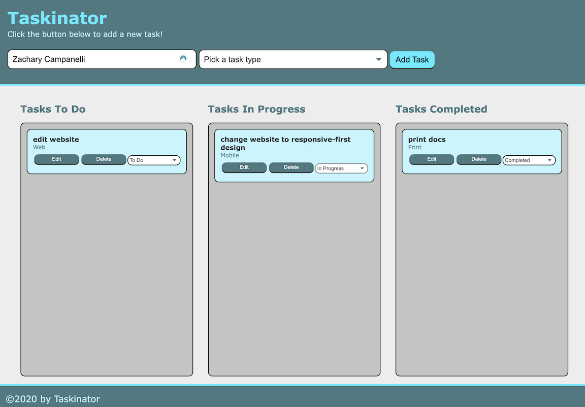

# Taskinator
  
## Description 

  
An application that allows you to create a list of tasks you need to complete, are in the process of completing, or have completed. Each task can be given a category of mobile, web, or print

## Table of Contents
* [Usage](#Usage)
* [License](#License)
* [Questions](#Questions)

## Usage
[Taskinator](https://zacharycampanelli.github.io/Taskinator/)

Simply enter the task you wish to add to the list in the input box on top and select what type of task it is. Once the task is added you can edit or delete it, or use the dropdown menu to decide what stage of completion the app is in

  

## License
A short and simple permissive license with conditions only requiring preservation of copyright and license notices. Licensed works, modifications, and larger works may be distributed under different terms and without source code.  

## Questions
If you have any questions, concerns, or comments, feel free to contact me:
  
-GitHub: [Zacharycampanelli](https://github.com/Zacharycampanelli)  
